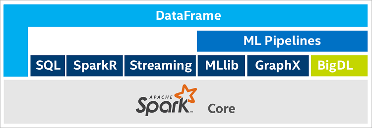

**一文读懂BigDL**

1.  **前言**

大数据和人工智能正在改变我们的生活。当前人工智能的进展主要得益于深度学习算法的突破。常见的深度学习框架包括TensorFlow、Torch、Caffe、Theano、CNTK等，不过这些框架都无法与目前主流的分布式大数据计算平台如Hadoop、Spark无缝集成。INTEL推出的BigDL是一款面向Apache
Spark的分布式深度学习库，提供类似Torch的深度学习支持，并可以使用事先训练好的Caffe或Torch模型。利用BigDL，用户可以像开放标准的Spark程序一样来开发深度学习应用程序，编写的程序可直接在现有的Spark或Hadoop集群上运行。BigDL在Spark生态系统中的角色如下图所示。BigDL还采用INTEL数学核心函数库（MKL）显著提升CPU的计算性能。据官方文档介绍，其在INTEL至强处理器上的运行速度可与GPU相当。

本文介绍如何使用BigDL开发简单的深度学习应用，方便更多的大数据开发工程师入门深度学习的开发技术。为学习BigDL开发技术，读者应对人工神经网络有基本的了解，另外需要掌握Spark部署、使用所需的基本技能，特别是熟悉Scala语言的常见语法。下面就让我们开始BigDL的启蒙之旅。

1.  **初识BigDL**

    1.  **安装BigDL**

>   我们先来安装BigDL。如果您已经部署好Spark，那安装BigDL应该不难。BigDL库的下载地址是https://bigdl-project.github.io/master/\#release-download/，下载后解压即可使用。建议下载最新的发布版，并注意与Spark版本的匹配。我们也可以下载BigDL的源码编译后使用，这样的好处是调试程序时可以跟踪到源代码中，前提是系统中已经安装了Maven、Scala、Git等开发所需的工具。使用Git从https://github.com/intel-analytics/BigDL下载BigDL的源码，运行BigDL中的make-dist.sh（或bash
>   make-dist.sh）即可在dist子目录生成BigDL库，其中最核心的文件为lib子目录下面的bigdl-VERSION-jar-with-dependencies.jar，其中VERSION为实际的版本号。如果我们想把BigDL安装到Maven的本地库中，可在BigDL源码目录执行命令mvn
>   clean install –DskipTests。另外值得一提的是-P
>   spark_2.x选项，把该选项添加在make-dist.sh或mvn clean install
>   –DskipTests命令的后面可生成形如bigdl-VERSION-jar-with-dependencies-and-spark.jar的文件。该文件把Spark也打包在里面，有时调试会更方便一点。

>   我们可以通过Spark Shell验证安装是否成功。启动Spark
>   Shell时，在jars选项中指定BigDL的jar文件。在笔者的机器上，执行的命令为

>   \# spark-shell --jars
>   /usr/local/dist-spark-2.1.1-scala-2.11.8-linux64-0.2.0-dist/lib/bigdl-  
>   SPARK_2.1-0.2.0-jar-with-dependencies.jar

>   在scala提示符下，依次执行下面两条语句。如果一切顺利，说明我们可以正常使用BigDL了。

>   scala\>import com.intel.analytics.bigdl.utils.Engine

>   scala\>Engine.init

1.  **BigDL中的基本概念**

在BigDL中，函数的输入和输出都是用Tensor（张量）表示的。Tensor的数学含义是多维数组。我们把1维数组称为向量，2维数组称为矩阵。而不管1维、2维、3维、4维，都可以称作张量，甚至标量（数字）也可以看作是0维的张量。在深度学习中，几乎所有数据都可以看作张量，如神经网络的权重、偏置等。一张黑白图片可以用2维张量表示，其中的每个元素表示图片上一个像素的灰度值。一张彩色图片则需要用3维张量表示，其中两个维度为宽和高，另一个维度为颜色通道。

Tensor实际上是模板类Tensor[T]，其中的T为元素的数据类型，可以是Float或Double，这是BigDL目前支持两种数据类型。实际上BigDL中的大部分类都是模板类，其中一个模板参数为数据类型。现在我们在Spark
Shell上演示Tensor的基本用法。

>   scala\> import com.intel.analytics.bigdl.tensor.Tensor

>   import com.intel.analytics.bigdl.tensor.Tensor

>   scala\> val a = Tensor(Array(1f,2f,3f,4f,5f,6f),Array(2,3))

>   a: com.intel.analytics.bigdl.tensor.Tensor[Float] =

>   1.0 2.0 3.0

>   4.0 5.0 6.0

>   [com.intel.analytics.bigdl.tensor.DenseTensor\$mcF\$sp of size 2x3]

>   scala\> val b = Tensor(Array(6f,5f,4f,3f,2f,1f),Array(2,3))

>   b: com.intel.analytics.bigdl.tensor.Tensor[Float] =

>   6.0 5.0 4.0

>   3.0 2.0 1.0

>   [com.intel.analytics.bigdl.tensor.DenseTensor\$mcF\$sp of size 2x3]

>   scala\> a + 1

>   res: com.intel.analytics.bigdl.tensor.Tensor[Float] =

>   2.0 3.0 4.0

>   5.0 6.0 7.0

>   [com.intel.analytics.bigdl.tensor.DenseTensor\$mcF\$sp of size 2x3]

>   scala\> a + b

>   res: com.intel.analytics.bigdl.tensor.Tensor[Float] =

>   7.0 7.0 7.0

>   7.0 7.0 7.0

>   [com.intel.analytics.bigdl.tensor.DenseTensor of size 2x3]

>   scala\> a \* b.t

>   res: com.intel.analytics.bigdl.tensor.Tensor[Float] =

>   28.0 10.0

>   73.0 28.0

>   [com.intel.analytics.bigdl.tensor.DenseTensor of size 2x2]

有些操作的输入涉及多个Tensor，如矩阵加法。BigDL中用Table表示多个Tensor的集合。对Table的相关操作都巧妙地封装在名为T的对象里面。需要注意的是，在BigDL的代码中，T通常是模板参数，而T()是Table的语法糖。

BigDL用DataSet表示训练和预测用的数据集。这里的DataSet与Spark
SQL中的Dataset没有关系，实际上是基于Spark
RDD实现的。数据集中的样本则用Sample表示，每个样本包含若干个特征和标签。训练模型时通常每次提交小批量的样本数据，称为MiniBatch。目前BigDL对DataSet、Sample、MiniBatch的设计还有些不够清晰的地方，如DataSet、MiniBatch并不是Sample的容器类，Sample的特征和标签是否用Tensor表示在各个版本中也不尽相同。好在BigDL提供了多个Transformer（转换器）可以方便地在这些对象之间相互转换，这在后面的例子中可以看到。

1.  **BigDL模型训练**

监督学习是机器学习最常见的方式。在监督学习中，先是通过数据训练模型（其实是调节模型的参数），再使用训练好的模型进行预测。与传统的机器学习相比，深度学习的训练过程要复杂得多。在深度学习中，通过调整神经网络中的参数对训练数据进行拟合，可以使得模型对未知的样本提供预测的能力，表现为前向传播和反向传播（Backpropagation）的迭代过程。在每次迭代的开始，首先需要选取全部或部分训练数据，通过前向传播算法得到神经网络模型的预测结果。因为训练数据都是有正确答案标注的，所以可以计算出当前神经网络模型的预测答案与正确答案之间的差距。最后，基于预测值和真实值之间的差距，反向传播算法会相应更新神经网络参数的取值，使得在这批数据上神经网络模型的预测结果和真实答案更加接近。如下图所示：

在BigDL中，训练过程的核心类是Optimizer。Optimizer默认的优化算法为SGD，可改为其他算法如Adam、Adagrad、RMSprop、LBFGS等。Optimizer在初始化时需要指定一个指标来指示如何优化模型中的参数，用来表示一个模型不尽人意的程度，训练的过程就是不断最小化这个指标，这个指标称为成本函数。BigDL提供了二三十种成本函数，包括均方差（MSECriterion）、交叉熵（CrossEntropyCriterion）等。

1.  **BigDL模型定义**

深度学习由于涉及的是多层网络，很多时候不能使用现成的模型，而是以已知模型为参照，根据应用场景进行定制，这个过程称为模型定义。比如逻辑回归从神经网络的角度看就是一层全连接网络再用SIGMOID函数去线性化，在BigDL中用代码表示为：

>   val model = Sequential()

>   model.add (Linear (inputSize, outputSize))

>   model.add (Sigmoid())

或者换成函数化编程的风格：

>   val model = Sequential().add (Linear (inputSize, outputSize)).add
>   (Sigmoid())

这里Sequential是网络的容器，各层网络在Sequential中是顺序叠加的。如果模型中涉及分支或合并，则需要结合ConcatTable或ParallelTable等处理分支或并行的容器。BigDL另外还提供了Functional
API，以图（Graph）的方式定义模型，更适合表达复杂的网络模型。

BigDL支持模型的保存和重新加载，如下面的代码所示。模型可保存到本地文件系统、HDFS等存储介质。

>   model.save ("/tmp/model.bigdl", true)

>   …

>   val model = Module.load ("/tmp/model.bigdl")

另外，作为深度学习的后来者，BigDL还充分考虑了与Torch、TensorFlow、Caffe等主流框架的兼容性。可使用Module对象的loadTorch、loadTF、loadCaffeModel方法加载Torch、TensorFlow、Caffe定义的模型，也可使用模型实例的saveTorch、saveTF、saveCaffe方法把模型保存为其他框架所需的格式。

1.  **BigDL示例**

图像处理是深度学习典型的应用场景。MNIST是一个图片集，包含70000张手写数字图片。每一张图片包含28
x 28个像素点。我们可以用一个数字数组来表示一张图片：

MNIST中也包含每一张图片对应的标签，告诉我们这个是数字几。比如，下面这四张图片的标签分别是5，0，4，1。

作为最经典的卷积神经网络，LeNet被用于解决MNIST手写体数字识别问题。LeNet也是BigDL实现的模型之一（https://github.com/intel-analytics/BigDL/tree/master/spark/dl/src/main/scala/com/intel/analytics/bigdl/models/lenet）。本文就参照BigDL中的LeNet探讨如何使用BigDL进行深度学习。需要指出的是，为了便于理解，本文在一些细节地方作了修改。

如果读者之前没有接触过卷积神经网络，可先阅读下面几篇文章以便对卷积神经网络有一个初步的认识：

>   1) http://blog.csdn.net/celerychen2009/article/details/8973218

>   2) http://blog.csdn.net/zouxy09/article/details/8781543

>   3) http://blog.csdn.net/hjimce/article/details/51761865

1.  **创建项目**

>   我们可以使用IntelliJ
>   IDEA或Eclipse创建基于BigDL的深度学习项目。这个过程与创建其他基于Spark的项目类似，包括对Scala、Spark的引用，当然还得添加对BigDL库的引用。在写这篇文章的时候，Maven的中央仓库中只能下载已经过时的0.1.0版本的BigDL，因此建议读者编译BigDL源码生成最新版本并存储到本地仓库（使用前面提到的mvn
>   install命令）。另外，目前版本的BigDL还存在一个BUG，必须添加对Spark
>   MLLib的引用，不论项目中是否用到。以Maven项目为例，在pom.xml的\<dependencies\>部分应包含类似下面的代码，注意您用到的版本可能有所不同。

>   \<dependency\>

>   \<groupId\>org.apache.spark\</groupId\>

>   \<artifactId\>spark-core_2.11\</artifactId\>

>   \<version\>2.1.0\</version\>

>   \</dependency\>

>   \<dependency\>

>   \<groupId\>org.apache.spark\</groupId\>

>   \<artifactId\>spark-mllib_2.11\</artifactId\>

>   \<version\>2.1.0\</version\>

>   \</dependency\>

>   \<dependency\>

>   \<groupId\>com.intel.analytics.bigdl\</groupId\>

>   \<artifactId\>bigdl\</artifactId\>

>   \<version\>0.3.0-SNAPSHOT\</version\>

>   \</dependency\>

下面是典型的BigDL项目入口代码。注意与Spark
1.x项目相比，BigDL通过Engine对象对初始化参数设置作了适当封装。

>   val conf = Engine.createSparkConf().setAppName("Lenet on MNIST")

>   val sc = new SparkContext(conf)

>   Engine.init

1.  **准备数据**

BigDL并没有提供下载和操作MNIST数据集的接口。我们得自己从http://yann.lecun.com/exdb/mnist/下载MNIST数据集。该网页上包含train-images-idx3-ubyte.gz、train-labels-idx1-ubyte.gz、t10k-images-idx3-ubyte.gz、t10k-labels-idx1-ubyte.gz这4个压缩文件的下载链接。下载这4个压缩包后，把它们解压到同一目录，并把解压后文件的名字中的“.”改为“-”。在解压后的文件中，train-images-idx3-ubyte为6000张训练图片、train-labels-idx1-ubyte为训练图片的标签、t10k-images-idx3-ubyte为1000张测试用图片、t10k-labels-idx1-ubyte为测试图片的标签。

我们还得把原始文件转换为BigDL所需的数据格式。这里只有厚着脸皮抄袭BigDL源码中的load函数（https://github.com/intel-analytics/BigDL/blob/master/spark/dl/src/main/scala/com/intel/analytics/bigdl/models/lenet/Utils.scala）。该函数是私有的，因此我们不能在应用程序中直接调用，而只有把代码复制出来。这个函数把图片文件和图片标签文件转换成ByteRecord数组。ByteRecord与Sample有点类似，分别用字节数组和浮点数存储特征与标签。下面的代码把Array[ByteRecord]转换为DataSet[MiniBatch[Float]]和RDD[Sample[Float]]类型，分别用于训练和测试。这里bytes为load函数返回的ByteRecord数组，sc为SparkContext实例，b为一次批处理的样本数量，而数字28为图片的尺寸。

>   val trainSet = DataSet.array(trainBytes, sc) -\>

>   BytesToGreyImg(28, 28) -\> GreyImgToBatch(b)

>   val testSet = (BytesToGreyImg(28,
>   28)-\>GreyImgToSample())(sc.parallelize(testBytes))

在上面的代码中，BytesToGreyImg、GreyImgToBatch、GreyImgToSample均为Transformer（转换器）的派生类，而-\>符号为Transformer定义的操作符。DataSet同样也重载了该操作符。对这段代码感到好奇的读者可以查阅BigDL实现Transformer和DataSet的源码（https://github.com/intel-analytics/BigDL/tree/master/spark/dl/src/main/scala/com/intel/analytics/bigdl/dataset）。

1.  **定义LeNet模型**

先来认识一下LeNet模型。从下图可以看出，LeNet包含两次的卷积和降采样，再经过两次全连接并使用Softmax分类作为输出。Softmax相当于多分类版本的Sigmoid。注意LeNet包含多个变体，因此各个文档对LeNet的描述会有些差异。

在BigDL中，图像的卷积用SpatialConvolution实现。SpatialConvolution
的输入和输出都是特征数x宽度x高度类型的3维数组，这可通过Reshape进行转换。可通过多个参数定制SpatialConvolution，其中前面8个参数依次是输入特征数、输出特征数、卷积窗口（书面术语为卷积核或过滤器）的宽度和高度、横向和纵向移动的步长、横向和纵向0填充的尺寸，其中前面4个参数是必填的。在图像处理中，通常纵向和横向的参数都是相同的。我们两次卷积都选择5
x
5大小的窗口，第一次卷积生成的特征数为6，第二次卷积生成的特征数为12。步长默认为1，通常不需要修改。0填充的尺寸默认为0，即不填充。注意如果不填充的话，卷积后的图像尺寸会变小。新边长的计算公式为：原边长-窗口边长+
1。如果想保持图像原来的大小，需在4个边上各填充 (窗口边长- 1) /
2。这里我们选择不填充。

卷积后使用Tanh函数去线性化，然后进行降采样。降采样在BigDL中用SpatialMaxPooling实现，需提供的参数依次为窗口宽度和高度、横向和纵向的步长、横向和纵向0填充的尺寸，其中前2个参数是必填的。通常情况下，降采样不进行0填充，并且步长与窗口尺寸相同。我们两次降采样都选择2
x 2的窗口，则每次降采样把图像的边长缩小为原来的一半。

两次卷积和降采样的实现代码如下。注意在第一次卷积和降采样后我们使用Tanh函数去除线性化。

>   import com.intel.analytics.bigdl.numeric.NumericFloat

>   import com.intel.analytics.bigdl.nn.\_

>   val model = Sequential()

>   model.add (Reshape (Array (1, 28, 28)))

>   .add (SpatialConvolution (1, 6, 5, 5,))

>   .add (Tanh())

>   .add (SpatialMaxPooling (2, 2, 2, 2))

>   .add (Tanh())

>   .add (SpatialConvolution (6, 12, 5, 5))

>   .add (SpatialMaxPooling (2, 2, 2, 2))

现在还剩下两次全连接和最后的分类。在BigDL中，全连接对应的模块为Linear。调用Linear所需参数为输入节点和输出节点数量，调用前需先使用Reshape把3维数组转换为1维数组。注意图片经过两次降采样，边长缩小((28
– 5 + 1)/2 - 5+1)/2 = 4，而特征数为12，因此Reshape后的数组长度为12 x 4 x
4，如果这里没有指定正确的话运行中会报“element number is: xxx , reshape size is:
xxx”之类的错误。我们为第一个全连接层指定100个输出节点，为第二个全连接层指定10个输出节点，对应0到9这10个数字，最后使用LogSoftMax函数分类。我们在两个全连接层之间也使用Tanh函数去除线性耦合。

>   model.add (Reshape (Array (12 \* 4 \* 4)))

>   .add (Linear (12 \* 4 \* 4, 100))

>   .add (Tanh ())

>   .add (Linear (100, 10))

>   .add (LogSoftMax())

1.  **训练和评估模型**

除了数据和模型外，训练的效果取决于成本函数和优化算法的选择。在这里，我们选择成本函数为Negative
Log-Likehood（ClassNLLCriterion），该函数与交叉熵函数类似。优化算法则选择Adam，该算法通常比其他方法更能缩短收敛时间。我们一共训练15个回合。

>   val optimizer = Optimizer (

>   model = model,

>   dataset = trainSet,

>   criterion = ClassNLLCriterion [Float] ())

>   optimizer.setOptimMethod (new Adam())

>   .setEndWhen(Trigger.maxEpoch(15))

>   .optimize()

到验证我们的模型是否有效的时候了。我们可以基于训练好的模型，用测试图片进行预测，并取预测的最可能数字与测试图片的实际标签进行对比。在BigDL中，可通过Top1Accuracy计算正确率。BigDL支持多个评估指标，因此evaluate方法的返回值为数组。这个数组的元素是评估结果和评估方法组成的二元组。

>   val results = model.evaluate (evaluationSet, Array (new
>   Top1Accuracy[Float]))

>   results.foreach { case(result,_) =\> println (s"top 1 accuracy is \$result")
>   }

1.  **总结**

BigDL
是基于Spark的深度学习库，对大数据的实现有着非常好的契合度，也有着比较全面的API，非常适合直接在Hadoop/Spark框架下使用深度学习进行大数据分析。但与其他深度学习框架相比，开源时间较短，发展不成熟，对GPU并没有良好的支持，是INTEL为了提高自家处理器的竞争能力而设计的。目前BigDL的学习资料还比较匮乏。除了官方网站外，读者使用BigDL进行开发时可查阅其他深度学习框架的资料，特别是Torch和PyTorch。

参考资料：

1.  BigDL官方文档 https://bigdl-project.github.io/master

2.  BigDL源码 https://github.com/intel-analytics/BigDL

3.  《BigDL：一种面向 Apache Spark的分布式深度学习》
    https://software.intel.com/zh-cn/articles/bigdl-distributed-deep-learning-on-apache-spark

4.  《PyTorch学习教程》 https://ptorch.com/news/27.html
